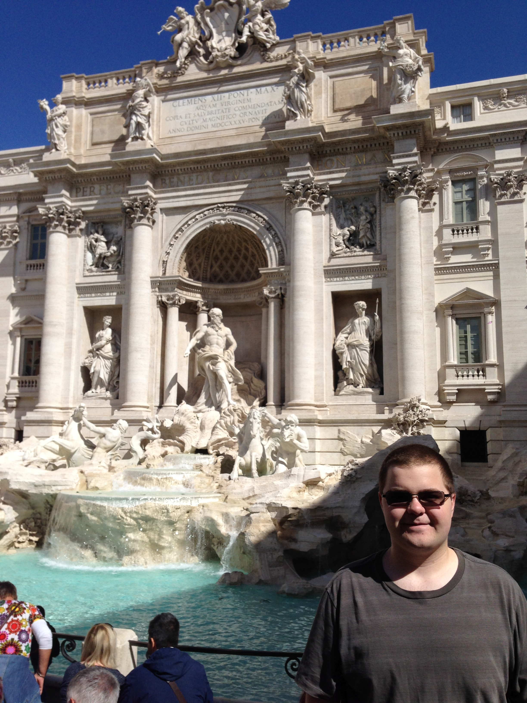
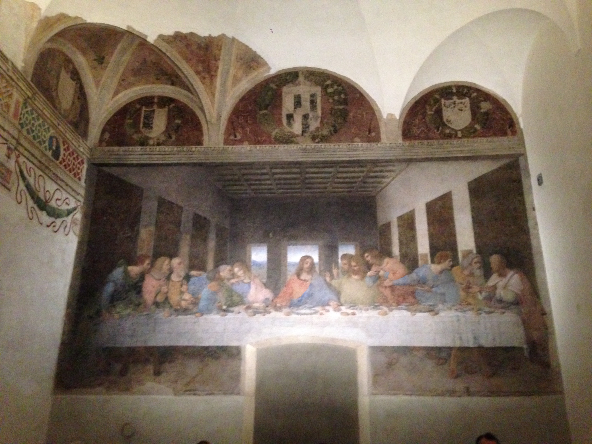

## My Lifemap

I was raised in a very Christian home.
We moved around from a small Wesleyan church to a small Vineyard church to a large non-denominational church.
Both my parents can speak in tongues and have gone on international mission trips.
We have had several people in bad life situations come live with us for months at a time.
However, life has not been entirely rosy for me.
My father dealt with a lot of unemployment before I was in high school and my parents were generally unwise financially.
To make a long story short, my parents declared bankruptcy and we had to foreclose on our house while I was in high school.
That period of time gave me a lot of anxiety and it has profoundly affected how I view money.
However, ever since I overcame that anxiety I have had a fundamental confidence that God is in control and that everything will work out fine.
I am quite frugal and have extensive budgets and financial goals but I have to balance that with Matthew 6:33.

I feel that I did not have very many Christian mentors in my formative years.
The churches that I went to as a child did not have very strong youth ministries and my limited experience in them led me to believe I was the only real Christian in that group because I saw how much their actions did not line up with their supposed faith in Jesus.
It was also unfortunate that no one at my church went to the same school until I switched churches in high school.
My parents have always said that I have a very clear sense of right and wrong, which led me to essentially always follow the rules and excel as a student.
That has led me to struggle with perfectionism and focusing on works instead of grace.
And of course I am by no means actually perfect, so that only led to cycles of guilt and shame.
I am a very introspective person and I am also excellent at disconnecting my emotions in certain situations (which is not always good, believe me).
But I do also struggle with anger and frustration that I am not able to control my situation.
One of the reasons that I joke so much about church phrases is that I believe those phrases help someone hide from actually doing things Jesus would do.
In general I suppose I have a cynical view of most people who claim to be Christians but are really "Churchians."

One interesting hard time that I have is that I think most people doubt if there is a God, but I doubt if that God could ever love me.
I am fully convinced that God exists and that Christianity is the only religion that makes sense logically.
However, because of my struggles with perfectionism and works-theology I doubt if God really loves me.
But since last Thanksgiving I've been in a period of contemplation and I have realized all of these base beliefs I have had and how badly I have misunderstood the gospel so I think I'm now on the right track.

#### Interlude of Images
In my senior year of high school, I went on a missions trip to China with my dad for two weeks.

For my junior year of college, I studied abroad in Ulm, Germany.

During that year, I took a trip to Italy for a week, among other travels.

I was able to see The Last Supper in the church where it was painted.

I have suffered from bouts of loneliness.
I have never dated anyone, but most of that is based on my choice.
In high school I was in a serious time of contemplation and I prayed to find out my future wife's name.
That night I had a dream where I received a text message with her name.
At a Rose-Hulman recruiting event I wondered to myself if she would be there as everyone was introducing themselves.
At that exact second a young woman with that name introduced herself.
Once I started at Rose-Hulman I met her the first night before classes started.
But I essentially never saw her again at school and she is actually now married.
I do still believe in this promise from God but I have had intense times of doubt.

One other dream I had was a conversation between Jordan Peterson and myself.
During the course of our conversation he mentioned Exodus 34 and Isaiah 9.
The next day I was listening to a Bible Project podcast that mentioned Exodus 34.

Exodus 34:6-7 is the passage that is most quoted in the Bible itself.

> The Lord passed before him and proclaimed,
>  “The Lord, the Lord, a God merciful and gracious, slow to anger,
>  and abounding in steadfast love and faithfulness, keeping steadfast love for thousands,
>  forgiving iniquity and transgression and sin, but who will by no means clear the guilty,
>  visiting the iniquity of the fathers on the children and the children's children,
>  to the third and the fourth generation.”

Isaiah 9 contains a promise of the coming child.

> For to us a child is born,
>     to us a son is given;
> and the government shall be upon his shoulder,
>     and his name shall be called
> Wonderful Counselor, Mighty God,
>     Everlasting Father, Prince of Peace.
> Of the increase of his government and of peace
>    there will be no end,
> on the throne of David and over his kingdom,
>    to establish it and to uphold it
> with justice and with righteousness
>    from this time forth and forevermore.
> The zeal of the Lord of hosts will do this.

I also have certain spiritual connections tied to music.
I played the alto saxophone in middle school and also sang in the choir for all of middle school and half of high school.
I have always loved listening to and singing along to music.
My favorite style of worship songs are long and calm.
For particular songs I actually have physical reactions such as spontaneous goosebumps and feeling like my blood has thickened.
I feel like music is a way for my soul to connection to God.

I want to end this lifeplan by talking about my brothers.
Biologically I only have a single sister, but since I met Jarred, Alex, and Zac in middle school I have had three brothers.
I also made multiple lifelong friends in college.
And now that I've joined this small group (thanks to Mr. Henderson) I have about 8-12 more.
I am more than eternally grateful for God for bringing these men into my life and I cannot imagine life without them.
I am who I am today because of the friendships I have.

